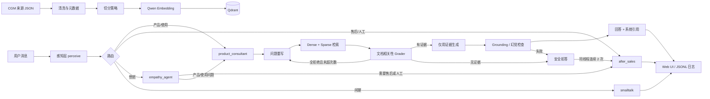

# CGM 智能客服 Agent Demo：功能设计说明

> 本文基于当前 `customer_agent_demo/` 源码梳理，而非概念方案。它说明 Demo 做什么、一次请求如何流转、每个设计决策解决什么问题，以及它与生产系统之间的边界。

## 1. 项目定位

`customer_agent_demo` 是一个可独立运行的 CGM（动态血糖仪）智能客服演示项目。它不依赖主项目的 Web 前端或业务数据库；其目标是把一套可解释的客服 Agent 最小闭环展示出来：

- 以可追溯的产品知识数据为输入，切分并写入 Qdrant 向量库；
- 先识别用户的意图、情绪和是否要求人工；
- 由产品咨询、情绪安抚、售后三个专职 Agent 分别处理，并可直接交接控制权；
- 对产品事实执行“检索—证据评分—生成—事实支撑检查”，没有可靠证据时明确拒答；
- 通过轻量 Web UI 展示会话隔离、当前 Agent、引用、检索候选和 C1 防线的各节点结果；
- 将每轮结果写入脱敏 JSONL，便于排障、评估和复盘。

它的重点不是模拟完整电商售后系统，而是验证客服场景里三个高风险能力：**该交给谁、能否依据知识回答、无法可靠回答时如何安全降级**。

## 2. 总体架构

上半部分是离线入库，下半部分是在线会话。两者解耦：修改知识源或切分策略后，需要重跑入库；在线服务只查询已建好的 collection。

## 3. 模块与责任边界

| 层次 | 主要文件 | 责任 | 不承担的责任 |
| --- | --- | --- | --- |
| 配置 | `config.py` | 读取 `.env`、统一 LLM/Embedding/Qdrant/防线参数 | 不写死密钥或环境差异 |
| 知识入库 | `ingest/pipeline.py`、`ingest/run.py` | 加载、清洗、切分、稳定 ID、重建 Qdrant | 不做客服路由和回答 |
| 感知 | `agent/perception.py`、`prompts/perception.md` | 输出受 schema 约束的意图、情绪、人工诉求 | 不回答产品事实 |
| 编排 | `agent/graph.py` | 维护会话状态、选择入口 Agent、执行 handoff | 不把所有业务判断塞进一个 prompt |
| RAG | `agent/rag.py`、`agent/hybrid.py` | 检索、证据判定、受控重试、生成、引用和幻觉防护 | 不处理订单、退款等业务系统动作 |
| 可观测性 | `agent/run_logger.py` | 脱敏记录真实执行轨迹 | 不替代生产级 tracing/审计平台 |
| 演示界面 | `web.py` | 本地会话 UI、`/api/chat`、C1 过程可视化 | 不提供登录、持久会话或多租户能力 |
| 质量验证 | `tests/`、`agent/evaluate_hallucination.py` | 回归测试和幻觉样例评估 | 不替代线上 A/B 或人工质检 |

## 4. 知识入库：为什么要从“来源”开始

入口是 `python -m customer_agent_demo.ingest.run`，其流程固定为：

1. `load_sources()` 从 `data/cgm_sources.json` 读取带标题、URL、产品、语言、来源类型和正文的可追溯记录。
2. `clean_documents()` 统一空白字符，并在切分前附上来源元数据。
3. `split_documents()` 生成可检索 chunk，并加入 `chunk_index`、`chunk_id`、`chunk_text` 等字段。
4. `upsert_to_qdrant()` 删除并重建 demo collection，再以稳定 UUID5 写入向量及元数据。

### 4.1 三种切分策略

由 `DEMO_CHUNKING_STRATEGY` 控制，默认 `structural`：

| 策略 | 做法 | 适合的对比点 |
| --- | --- | --- |
| `recursive` | 按字符大小和重叠的基线切分 | 简单、稳定，作为效果基准 |
| `structural` | 复用主项目的标题、章节、目录和续段语义切分 | 客服知识常有“条件 + 限制”跨句出现，推荐默认 |
| `parent-child` | 用较小 child 做 embedding，命中后把 parent context 作为回答上下文 | 短问题需要精确召回、答案又需要较完整上下文 |

选择“删除并重建 collection”而非增量更新，是 Demo 的有意取舍：embedding 模型维度是 collection 创建时的固定约束，演示中换模型或换切分策略时，重建更可复现、更容易解释；代价是它不适合大规模生产增量同步。

### 4.2 为什么同时保留 Dense 和 Sparse

`agent/hybrid.py` 把 Qdrant 的向量检索与本地关键词稀疏检索融合。Dense 擅长语义相近表达；Sparse 对“IP28、14 天、连接码”等参数型词汇更敏感。两路以归一化分数和 `AGENT_FUSION_ALPHA` 融合：越接近 1 越偏 Dense，越接近 0 越偏 Sparse。

这并不意味着融合结果可直接作为事实依据。融合只是“召回候选”；后面的 document grader 才判断文档是否真的覆盖用户所问属性。这样避免“含有数字、产品名相同、向量分高”被误当成证据。

## 5. 在线会话：感知与 Swarm 编排

`CustomerAgent.invoke(message, thread_id)` 是后端唯一的会话入口。它使用 LangGraph 的 `InMemorySaver` 将同一个 `thread_id` 的消息、当前话题、失败次数等状态放在同一条会话链中。

### 5.1 先感知、后执行

`perceive` 节点调用 `PerceptionService`，返回受 Pydantic schema 约束的：

- `intent`：产品咨询、使用问题、售后诉求、闲聊；
- `emotion`：平静、不满、愤怒；
- `handoff_requested`：是否明确要求人工、客服、投诉、退款或赔偿；
- `confidence`、`reason`：供排错和界面展示。

配置 LLM 时使用 `with_structured_output(PerceptionResult)`；未配置时使用确定性的关键词启发式兜底。这样的降级让单测和本地演示仍可跑通，但真实分类质量只能以配置模型后的结果为准。

同时，`_resolve_topic()` 把明确的品牌/型号或高置信检索结果整理成 `current_topic`，让下一轮“它防水吗”可继承上一轮设备上下文。这个话题状态被 `thread_id` 隔离，不能跨会话污染。

### 5.2 为什么选择 Swarm，而不是 Supervisor

这里的 Swarm 是“平级专职 Agent 直接交接”，而不是一个中心主管每轮重新分配：

| Agent | 入口条件 | 能力与输出 | 交接规则 |
| --- | --- | --- | --- |
| `product_consultant` | 产品咨询、使用问题 | 调用 C1 RAG，返回有证据的客服答案 | 同线程连续两次证据不足，转 `after_sales` |
| `empathy_agent` | 愤怒 | 先安抚，明确不承诺未知补偿 | 仍需人工/售后转 `after_sales`；普通产品问题转 `product_consultant` |
| `after_sales` | 人工、退款、订单、物流、投诉等 | 生成坐席交接摘要 | 本 Demo 到此结束，不假装执行真实退款/订单操作 |
| `smalltalk` | 无明确 CGM 诉求 | 固定欢迎语 | 不调用 RAG |

交接用 LangGraph 的 `Command(goto=..., update=...)` 更新 `active_agent` 并跳到目标节点。它符合客服连续性：一旦升级到人工，不应再回到产品 Agent 继续自动回复。相比 Supervisor，它减少了一个“中央决策模型”的额外延迟和不确定性，也让责任边界更清晰；代价是新增 Agent 时需显式维护业务交接规则。

### 5.3 转人工不是一句“已转人工”

`after_sales` 通过 `build_handoff_summary()` 输出结构化摘要：最近三条问题、当前意图/情绪、最近已尝试答案、命中的知识来源、未解决原因、建议坐席下一步。这解决了人工接手时反复让用户描述的问题，也让 Demo 的 handoff 可检查、可演示。

## 6. C1 RAG 防线：回答前后都需要门槛

产品咨询并非“检索到几段文本就让模型回答”，而是在 `RagService.answer()` 中执行受限的 Self-RAG + CRAG 风格闭环：

1. **问题重写**：将口语化/指代不完整的提问改写成独立检索 query，只能利用明确的会话话题，不能补造事实。
2. **召回候选**：按 `dense` 或 `hybrid` 获取 `top_k`（默认 4）候选，保留 candidate hits 以便调试。
3. **文档相关性评分**：逐条输出 `yes/no + reason`。优先 temperature=0 的结构化 LLM grader；模型不可用时才降级到关键词覆盖度检查。低于最小相关度的结果会先被拦截。
4. **受限纠错重试**：所有候选均被拒绝时，带入被拒片段重写 query 并重试。次数受 `AGENT_CORRECTIVE_RETRIES` 限制，默认 1，避免无边界循环和成本失控。
5. **证据门**：没有通过评分的文档时，返回固定的“没有足够依据，不编造”答案，不调用生成模型，也不向用户显示引用。
6. **基于证据生成**：仅把通过的文档作为 context。系统先移除模型自行生成的引用段，再统一拼接去重后的确定性引用。
7. **生成后 Grounding 检查**：先检查引用格式，再由结构化 LLM 判定每条事实是否被 evidence 支撑；不可用时以数字一致性硬规则兜底。失败则降级为拒答。

四种失败类型将“答错”拆成可修复的问题：

| 失败类型 | 表示什么 | 应优先改哪里 |
| --- | --- | --- |
| `knowledge_missing` | 库中根本没有支撑材料 | 补充来源并重新入库 |
| `retrieval_mismatch` | 有候选但不回答所问属性 | 调 chunk、Sparse/Dense 融合、重写或 rerank |
| `hallucination` | 生成内容超出了证据 | 收紧 prompt、增强 grounding gate、拒答 |
| `format_unstable` | 引用或输出结构不合规 | 结构化输出或确定性后处理 |

这种设计的关键原则是：**向量相似度是检索信号，不是事实真值；引用是系统生成的可追溯产物，不依赖模型自由发挥。**

## 7. Web UI 与 API 设计

`web.py` 用标准库 `ThreadingHTTPServer` 提供轻量 UI，而不是引入主项目的前端框架：

- `GET /`：返回单文件聊天界面；
- `GET /api/health`：本地健康检查；
- `POST /api/chat`：请求体为 `{ "message", "thread_id" }`，调用 `CustomerAgent.invoke()`；
- 响应包含回答、`active_agent`、感知结果、证据文档、C1 `debug_trace`、失败次数和交接摘要。

浏览器在 `localStorage` 中保存会话列表、当前 `thread_id` 与主题设置；后端则根据该 ID 使用 LangGraph checkpoint 保存对话上下文。两层配合的目的是让“新增对话”和会话切换在界面上可见，同时确保后端状态不会串线。

右侧检查面板展示 `pipeline_steps`、文档 grader 结果、被拦截候选和 hallucination decision。它不是面向普通终端用户的生产交互，而是特意让研发/汇报者能看到模型为什么回答、为什么拒绝、为什么转人工。

## 8. 可观测性、评估与测试

每次 `invoke()` 结束后，`AgentRunLogger` 会把一行 JSON 写入 `data/runs/agent_runs_YYYYMMDD.jsonl`，记录 thread、原消息、感知、活跃 Agent、话题、回答状态、检索结果、trace、转交原因和耗时；写入前递归删除 key、token、secret、password 等敏感字段。

现有测试覆盖了这套设计最容易回归的边界：

- 入库 metadata、结构化切分、parent-child 上下文；
- Dense/Sparse 融合、无 Dense 时的 Sparse 降级、chunk identity 一致性；
- 感知 schema、产品/情绪/人工路由、连续两次无证据转人工、线程隔离与话题继承；
- 高分但不相关文档被 grader 拦截、CRAG 重试上限、数字幻觉和引用格式；
- 无证据时无用户引用、引用去重、模型拒答后的检索可见性；
- 日志写入与敏感字段脱敏。

`python -m customer_agent_demo.agent.evaluate_hallucination` 额外运行 10 条案例，其中包括知识库外问题，检查是否应拒答、是否错误带引用、是否命中期望来源、是否虚构高危数字。

## 9. 配置、启动与演示顺序

主要环境变量集中在 `.env.example` / `config.py`：

- 模型：`QWEN_API_BASE`、`QWEN_API_KEY`、`QWEN_LLM_MODEL`、`QWEN_EMBEDDING_MODEL`；
- 向量库：`QDRANT_URL`、`QDRANT_COLLECTION`、`EMBEDDING_VECTOR_SIZE`；
- RAG：`AGENT_TOP_K`、`AGENT_RETRIEVAL_STRATEGY`、`AGENT_FUSION_ALPHA`、`AGENT_CORRECTIVE_RETRIES`、`AGENT_LLM_GRADERS_ENABLED`；
- 入库：`DEMO_CHUNKING_STRATEGY`；
- 日志：`AGENT_RUN_LOG_ENABLED`、`AGENT_RUN_LOG_DIR`。

推荐演示顺序：

1. 启动 Qdrant，并先运行入库；
2. 启动 `python -m customer_agent_demo.web --host 127.0.0.1 --port 7860`；
3. 问“可以戴着洗澡吗？”：展示产品咨询、RAG、引用；
4. 问“订单为什么还没发货？”：展示售后直接交接；
5. 问“太差了，我要投诉，马上人工！”：展示先安抚再交接及摘要；
6. 问知识库外的参数问题：展示 grader 拒绝、有限重试、安全拒答；
7. 新增会话后问“它防水吗？”：展示 `thread_id` 隔离，说明无上文时不会继承前一会话产品。

脚本 `scripts/start_demo.sh` 会复用/启动本地 Qdrant 并拉起 Web 服务，但不会自动入库；首次或知识变化后仍需先显式执行 ingest。这是一个需要在演示前注意的运行前置条件。

## 10. 生产化时需要补齐的部分

Demo 有意把关键决策做得清晰，但仍是单机教学/验证版本。生产化建议按优先级补齐：

1. 将 `InMemorySaver` 和浏览器 localStorage 改为有生命周期管理的持久会话存储，并隔离租户与用户身份。
2. 将 `after_sales` 的摘要对接真实工单、订单和 CRM 能力；交接应创建可追踪任务，而不是只返回文字。
3. 将 Qdrant 重建式入库改为版本化、增量化、可回滚的索引流程，记录 source version 与 embedding version。
4. 对检索、grader、生成、人工结果建立线上指标与离线标注集，持续评估拒答率、命中率、转人工率、幻觉率、延迟和成本。
5. 用鉴权、限流、敏感信息脱敏/审计、超时重试和熔断替代当前的本地 HTTP 服务防护。
6. 为 LLM grader 增加 prompt 版本、模型版本和灰度策略；当前“LLM 不可用时退回启发式”的机制保证可运行，但不等同于质量保证。

## 11. 可用于汇报的一句话

> 我们把客服 Agent 设计成“先感知分流、再由专职 Agent 处理、所有产品事实必须经过证据门控”的可解释闭环；当知识不足或用户需要业务处理时，系统不会猜测，而是带着上下文和已尝试结果把会话交给人工。

## 12. 代码阅读路线

若需要继续从代码理解设计，建议按这个顺序阅读：

1. `config.py`：先认清运行时能力开关；
2. `ingest/pipeline.py`：理解知识如何变成可追溯 chunk；
3. `agent/models.py`：理解跨模块 schema 与图状态；
4. `agent/perception.py`：理解“先分类再执行”；
5. `agent/graph.py`：理解路由、会话、handoff；
6. `agent/rag.py` 与 `agent/hybrid.py`：理解 C1 防线如何真正拦截无证据回答；
7. `web.py`：确认哪些决策对演示者可见；
8. `tests/test_agent_demo.py`、`tests/test_rag_defense_pipeline.py`：用行为边界反向验证上述设计。
