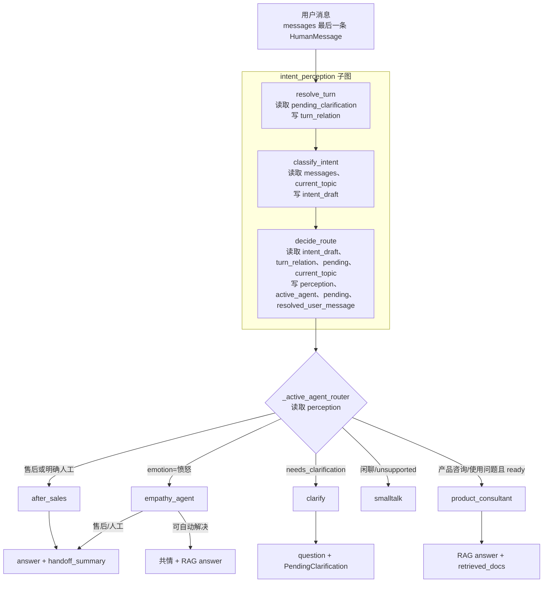

# 意图识别与安抚节点：按字段流转快速上手

> 本文对应当前 `customer_agent_demo` 源码。阅读目标不是背字段，而是能回答：**一条用户消息进来后，哪个模块写了什么字段，下一模块为什么读取它，最终为何走到 RAG、安抚、售后或澄清。**

## 0. 先用一句话建立全局画面

这个 Demo 不让 LLM 一次性决定全部事情。它将过程拆为：

```text
用户原话
  → 识别语义（意图、情绪、实体）
  → 业务策略（信息够不够、是否域外、是否延续上一轮）
  → 路由（该由哪个 Agent 处理）
  → 执行（RAG、安抚、售后、澄清或闲聊）
```

其中前 3 步被包成 `intent_perception` 子图；它的输出是 `PerceptionResult`。主图不需要关心“模型如何分类”，只读取这个结果并分发。

## 1. 先分清四种东西，后面不会乱

| 名称 | 可以把它理解为 | 是否由 LLM 直接输出 | 作用 |
| --- | --- | --- | --- |
| `IntentDraft` | **识别草稿** | 是 | 仅描述用户这句话表达了什么 |
| `PerceptionResult` | **分诊结论** | 否，Python 基于草稿补全 | 明确当前能否执行、该不该追问、为什么 |
| `PendingClarification` | **跨轮便签** | 否 | 上一轮缺什么、已经问过什么、用户已补了什么 |
| `AgentState` | **整条会话的病历** | 否 | LangGraph 在同一个 `thread_id` 内保存的所有执行状态 |

重点：`IntentDraft` 不是最终路由结果；`PerceptionResult` 才是。

例如用户说“这个怎么用？”：

```text
IntentDraft：使用问题，平静，product=None
PerceptionResult：使用问题，但 actionability=needs_clarification
                因为没有上文，"这个"没有指代对象
最终节点：clarify，而不是 RAG
```

## 2. 模块图：字段从谁流向谁



对应文件：

- [`agent/graph.py`](../agent/graph.py)：图、节点、状态写入和路由。
- [`agent/perception.py`](../agent/perception.py)：LLM/启发式识别、确定性策略。
- [`agent/models.py`](../agent/models.py)：所有字段的 Pydantic/TypedDict 合同。
- [`data/intent_catalog.yaml`](../data/intent_catalog.yaml)：每类意图的处理器、必填槽位、是否直接交接。

## 3. 每个模块到底读什么、写什么

这一节是看代码时最有用的“字段流转表”。箭头右侧是该字段下一步的消费者。

### 3.1 `resolve_turn`：先确定“这句话和上一轮什么关系”

位置：`CustomerAgent._resolve_turn()`。

| 读取 | 处理 | 写入 | 下一步谁用 | 为什么要先做它 |
| --- | --- | --- | --- | --- |
| `messages` 最后一条用户消息 | 判断是否明显是新话题 | `turn_relation` | `decide_route` | “GS3”可能是补充型号，也可能是独立消息；不先判断轮次，无法正确合并上下文 |
| `pending_clarification` | 存在时区分 `new_request`、`clarification_answer`、`correction` | `turn_relation` | `decide_route` | 只有补充/纠正才应接着回答旧问题；新话题必须清掉旧澄清 |

当前规则：有未完成澄清时，出现“不是”“不对”“改成”“应该是”是 `correction`；明显域外新话题是 `new_request`；其余默认 `clarification_answer`。

### 3.2 `classify_intent`：只将原话变成语义草稿

位置：`CustomerAgent._classify_intent()` → `PerceptionService.classify_draft()`。

| 读取 | 写入 | 值的来源 | 下一步谁用 | 为什么这样拆 |
| --- | --- | --- | --- | --- |
| `messages` 最后一条 | `intent_draft.intent`、`emotion`、`entities` 等 | 配置 LLM 时 `with_structured_output(IntentDraft)`；未配置时关键词兜底 | `decide_route` | LLM 只负责理解语言，不直接控制业务流程 |
| 历史 `messages`（带“用户/助手”角色） | `intent_draft` | 最近有限轮上下文 | `decide_route` | 可理解“它”“这个”，又不会把助手说过的话当成用户诉求 |
| `current_topic` | 草稿中的 `entities.product` 可受其辅助理解 | 会话中已确认的型号 | `decide_route` | 用户不必每轮重复型号 |
| 分类来源 | `perception_trace.classifier_source` | `llm` / `fallback` / `injected` | Web、日志、排错 | 同一流程可用于真实模型、离线演示和单测，但必须能区分来源 |

提示词 [`prompts/perception.md`](../prompts/perception.md) 明确禁止 LLM 返回 `route`、`clarification`、`question`。这些是规则层职责。

### 3.3 `decide_route`：把草稿变成真正可执行的分诊结论

位置：`CustomerAgent._decide_route()` → `decide_perception()`。

| 读取 | 判断/合并规则 | 写入 | 后续消费者 |
| --- | --- | --- | --- |
| `intent_draft` | 读取意图、情绪、实体、人工诉求 | `perception` 的基础字段 | 所有执行节点 |
| `turn_relation` + `pending_clarification` | 若是补充/纠正，合并上轮已收集实体；若为新诉求，废弃旧澄清 | `resolved_user_message`、新的/空的 `pending_clarification` | `clarify`、RAG |
| `current_topic` | 本轮无产品时可继承；成功识别产品/检索到单一标签时可更新话题 | `current_topic` | 下一轮识别、RAG |
| 意图目录 | 使用问题要求 `product`、`issue`；售后 `direct_handoff=true` | `perception.actionability`、`clarification` | 路由器 |
| 医疗域外规则 | 标记为 `unsupported` | `perception` | `smalltalk`，不会调用 RAG |
| 全部决策 | 生成可观测说明 | `perception_trace.policy_decision` | Web、日志、排错 |

这个节点最终会写入最重要的几个会话字段：

```python
{
    "perception": perception,                # 分诊结论
    "current_topic": topic,                  # 当前已确认型号/主题
    "active_agent": active_agent,            # 预选执行者
    "pending_clarification": pending,        # 跨轮澄清便签
    "resolved_user_message": resolved_message, # 合并后的完整问题
    "dialogue_status": "ready",             # 当前对话阶段
}
```

### 3.4 路由器：只读 `perception`，按固定优先级选择节点

位置：`CustomerAgent._active_agent_router()`。

```text
1. emotion == 愤怒                         → empathy_agent
2. handoff_requested 或 intent == 售后诉求 → after_sales
3. actionability == needs_clarification    → clarify
4. intent == 闲聊 或 unsupported            → smalltalk
5. 其他 ready 的产品/使用问题               → product_consultant
```

这就是“情绪优先于业务意图”的具体含义：愤怒用户即使问的是使用问题，也先进入安抚；安抚后再决定是否 RAG 或交接。

## 4. 所有核心字段：定义、来源、流向、设计原因

### 4.1 `PerceptionEntities`：下游真正需要的用户事实

| 字段 | 来源 | 流向 | 注释 | 为什么存在 |
| --- | --- | --- | --- | --- |
| `product` | 模型从原话提取；或由 `current_topic`/澄清补入 | 槽位校验、RAG 话题提示、摘要 | 型号，如 `GS3`、`Dexcom G7` | 不同产品对应不同知识；会话继承避免用户重复说型号 |
| `issue` | 模型从原话提取 | 使用问题槽位校验、RAG、摘要 | 现象，如“连接不上”“读数不准” | 检索需要具体故障；“坏了/不行”会被视为缺信息，避免编造排障步骤 |
| `requested_action` | 模型从原话提取 | 可供澄清/扩展流程使用 | 目标动作，如排障、查询、退款 | 将“什么对象有问题”与“用户想做什么”分开，便于将来扩展更多业务流程 |

### 4.2 `IntentDraft`：语义层的全部字段

| 字段 | 值/类型 | 下一站 | 注释与设计原因 |
| --- | --- | --- | --- |
| `intent` | 四个主意图 | 意图目录、路由 | 用枚举而非自由文本，使路由稳定、可测 |
| `emotion` | 平静 / 不满 / 愤怒 | 路由器、安抚节点 | 三档简化客服升级决策；仅愤怒抢占路由，避免过度安抚 |
| `confidence` | 0–1 | Web/日志 | 当前不是硬阈值；保留以便评估模型质量，不把模型自评误当可靠规则 |
| `handoff_requested` | `bool` | 路由、售后摘要 | 用户显式升级与意图分离：产品问题也可能要求人工 |
| `is_greeting` | `bool` | 策略层 | 区分“你好”（可欢迎）与域外闲聊（应说明能力边界） |
| `secondary_intents` | 次要意图列表 | Web、日志、人工摘要 | 只路由一个主意图，但不丢掉复合诉求 |
| `entities` | 上表三个实体 | 策略、RAG、摘要 | 让下游读取稳定结构而非重复解析原句 |
| `evidence` | 最多 240 字 | `intent_evidence`、`reason` | 保留用户原话中的分类证据，帮助排错且限制日志膨胀 |

`IntentDraft` 会规范化部分模型兼容输出：如英文 `troubleshooting` 会映射为 `使用问题`，`entities=null` 变为 `{}`，空字符串实体视为缺失。原因是不同 OpenAI 兼容服务的 JSON 细节不一致，而下游只接受稳定中文枚举与结构。

### 4.3 `ClarificationDecision`：一次追问的全部字段

| 字段 | 来源/值 | 流向 | 注释与设计原因 |
| --- | --- | --- | --- |
| `needed` | 策略层 `True/False` | `clarify`、API | 单一开关让 UI 先判断是否展示追问；为 false 时其余字段被清空，防止沿用旧问题 |
| `reason` | `missing_target`、`missing_goal`、`missing_detail`、`ambiguous_reference`、`low_confidence` | 日志、统计 | 标准化原因可统计“最常缺什么”，不用解析自然语言 |
| `missing_slots` | `target_product`、`user_goal`、`problem_detail`、`reference_target` | `PendingClarification` | 使用业务槽位名，便于 UI 和多语言文案映射；当前每轮只追一个，降低用户负担 |
| `question` | 策略生成的字符串 | `clarify` 最终回答 | 不让 LLM 临时自由提问；`needed=True` 时强制存在，避免图进入无回答状态 |
| `options` | 最多 4 个候选 | Web/API | 首轮隐藏、第二轮展示；提供帮助但不把第一次对话变成填表 |

### 4.4 `PerceptionResult`：子图的完整输出

| 字段 | 谁写入 | 谁读取 | 注释与设计原因 |
| --- | --- | --- | --- |
| `intent` | 策略层（通常继承草稿） | 路由、摘要 | 补充轮可以继承 `suspected_intent`；用户只回答“GS3”不会被误判闲聊 |
| `emotion` | 草稿继承 | 路由器、安抚 | 让强负面情绪在业务处理前先被响应 |
| `confidence` | 草稿继承 | 日志/UI | 保留分类质量信号 |
| `handoff_requested` | 草稿/策略 | 路由、售后 | 显式人工诉求可直接升级 |
| `secondary_intents` | 草稿去重后 | 日志、摘要 | 记录多诉求，不启动多个并行 Agent |
| `turn_relation` | `resolve_turn` | 策略、trace | 控制能否合并旧澄清，防止跨话题污染 |
| `actionability` | `decide_perception` | 路由器 | 把“是什么意图”和“现在能否执行”分开；`ready`、`needs_clarification`、`unsupported` 三选一 |
| `entities` | 草稿 + 主题 + 补充合并 | RAG、澄清、摘要 | 汇总多轮事实，避免各执行节点各自猜上下文 |
| `clarification` | `decide_perception` | `clarify`、API | 给追问节点一份完整、受 schema 约束的合同 |
| `intent_evidence` | 草稿 `evidence` | trace/UI | 回答“为什么判成此意图” |
| `classifier_source` | 分类节点 | trace/UI | 区分 LLM、fallback、测试注入，便于衡量可信来源 |
| `policy_reason` | 策略层 | trace/UI | 回答“为什么这样路由/追问/拦截” |
| `reason` | 草稿证据或策略 | UI/日志 | 一句面向人的概述，不要求调用方解析技术字段 |

关键约束：只要 `actionability="needs_clarification"`，Pydantic 就要求 `clarification.needed=True` 且必须有 `reason`、`missing_slots`、`question`。这让“需要追问却没有问题可问”的非法状态无法进入主图。

### 4.5 `PendingClarification`：跨轮保存的全部字段

| 字段 | 谁写入 | 谁读取 | 注释与设计原因 |
| --- | --- | --- | --- |
| `original_request` | `decide_route` | 生成 `resolved_user_message`、RAG | 第二轮“GS3”要和首轮“这个怎么用”拼成完整检索问题 |
| `suspected_intent` | `decide_route` | 补充轮策略 | 补充消息短且语义弱，保留首轮意图避免重新误分类 |
| `missing_slots` | 策略层 | 补充校验、人工摘要 | 明确下一轮要验证什么 |
| `asked_slots` | `clarify` | 后续澄清 | 记录问过的槽位，避免循环提问 |
| `collected_entities` | `decide_route` | 补充合并 | 收集多轮型号、现象、动作，不让用户反复描述 |
| `turn_count` | `clarify` | 路由器 | 达到 `agent_max_clarification_turns` 后人工交接，防止无限对话 |
| `last_question` | `clarify` | 日志/恢复/摘要 | 让系统和人工都知道机器人刚刚问了什么 |

### 4.6 `AgentState`：执行层还会写哪些字段

`AgentState` 是整条图的共享状态。除上面字段外，以下字段最常被执行节点写入：

| 字段 | 谁写 | 谁读 | 作用 |
| --- | --- | --- | --- |
| `messages` | `invoke()` 与每个回答节点 | 分类、摘要、下一轮历史 | LangGraph 消息累加器；保存用户/助手对话 |
| `intent_draft` | `classify_intent` | `decide_route` | 语义草稿；作为“模型理解”和“业务决策”之间的唯一输入合同 |
| `injected_perception` | `classify_intent`（仅测试注入 `perception_fn` 时） | `decide_route` | 让测试能直接提供固定感知结果，不依赖 LLM；正常运行通常为空 |
| `perception` | `decide_route` | 路由器、安抚、售后、澄清、Web | 完整分诊结论；执行层不需要再从原话猜意图 |
| `perception_trace` | `classify_intent`、`decide_route` | Web、日志、排错 | 同时保留 `semantic_classification` 和 `policy_decision`，区分模型识别问题与规则问题 |
| `active_agent` | 策略层/执行节点 | 路由、Web | 当前/最终由谁处理：产品、售后、安抚、澄清或闲聊 |
| `current_topic` | 策略层 | 下一轮分类、RAG | 同一线程已确认的产品话题 |
| `resolved_user_message` | 策略层 | RAG、安抚 | 将原问题与补充信息拼好后的完整问题 |
| `dialogue_status` | 策略/执行节点 | Web/API | `ready`、`awaiting_clarification`、`handed_off`、`completed` |
| `answer` | 执行节点 | Web/API | 最终展示给用户的话 |
| `answer_status` | RAG/安抚 | RAG失败计数、Web | `grounded` 或 `insufficient_evidence`；非 RAG 节点为 `None` |
| `retrieved_docs` | RAG/安抚 | Web、交接摘要 | 命中的证据文档；交接/闲聊时清空旧结果，避免串状态 |
| `debug_trace` | RAG/安抚 | Web、日志 | 检索、grader、grounding 等调试细节 |
| `failed_rag_count` | `product_consultant` | 自动交接逻辑 | 同一线程连续两次证据不足后转人工 |
| `handoff_reason` | 策略/产品/安抚 | `after_sales`、摘要 | 明确为何交接，避免人工重新判断 |
| `handoff_summary` | 安抚/售后 | Web/API | 给人工的上下文摘要；当前只是文本模拟，未创建真实工单 |

## 5. 三条消息，逐字段走一遍

### 场景 A：信息齐全的普通使用问题

输入：`GS3 蓝牙连接不上，怎么处理？`

```text
1) resolve_turn
   pending_clarification = None
   → turn_relation = new_request

2) classify_intent
   messages + history + current_topic
   → intent_draft = {
       intent: 使用问题,
       emotion: 平静,
       handoff_requested: false,
       entities: {product: GS3, issue: 蓝牙连接不上, requested_action: 排障}
     }

3) decide_route
   使用问题要求 product + issue，当前均存在
   → perception.actionability = ready
   → current_topic = GS3
   → active_agent = product_consultant

4) router → product_consultant
   resolved_user_message 交给 RAG
   → answer / answer_status / retrieved_docs / debug_trace
```

这里没有进入安抚，因为 `emotion=平静`；也没有进 `clarify`，因为必填槽位齐全。

### 场景 B：信息不全，需要跨两轮拼接

第一轮输入：`这个怎么用？`

```text
intent_draft.entities.product = None
perception = {
  intent: 使用问题,
  actionability: needs_clarification,
  clarification: {
    needed: true,
    reason: ambiguous_reference,
    missing_slots: [reference_target],
    question: 你说的“这个”具体是哪个产品或型号？
  }
}
pending_clarification = {
  original_request: 这个怎么用？,
  suspected_intent: 使用问题,
  collected_entities: {product: None, issue: None, requested_action: None},
  turn_count: 1
}
router → clarify
```

第二轮输入：`GS3`

```text
resolve_turn → clarification_answer
classify_intent → 本轮只识别出 product=GS3
decide_route → 合并 collected_entities + 本轮 product
              → 发现 reference_target 已补齐
              → 沿用 suspected_intent=使用问题
              → resolved_user_message = "这个怎么用？\n用户补充：GS3"
              → actionability=ready
router → product_consultant → RAG
```

设计价值：RAG 最终收到的是完整问题，而不是孤立的 `GS3`。

### 场景 C：愤怒用户，但仍能自动解决

输入：`GS3 读数不准，太差了！`

```text
intent_draft = {
  intent: 使用问题,
  emotion: 愤怒,
  handoff_requested: false,
  entities: {product: GS3, issue: 读数不准}
}

perception.actionability = ready
_active_agent_router：emotion=愤怒 优先于 使用问题
→ empathy_agent

empathy_agent：
  读取 perception.intent / emotion / entities.issue / resolved_user_message
  先生成共情话术
  因为未要求人工、也不是售后
  → 调 RAG
  → answer = 共情 + 有证据的排查建议 + 转人工入口
  → active_agent = product_consultant
```

愤怒不等于“必须转人工”。本项目的策略是先安抚；若问题仍可依据知识解决，给方案并保留升级入口。

若输入换为 `太差了，我要投诉，马上转人工！`，`handoff_requested=True`、`intent=售后诉求`；安抚节点生成共情后写入 `handoff_reason`、`handoff_summary`，最终状态是 `dialogue_status=handed_off`、`active_agent=after_sales`。

## 6. 为什么意图识别被设计为子图

主图需要解决“下一个专职 Agent 是谁”；意图子图需要解决“用户这句话是什么意思、信息够不够”。两者是两种职责。

```text
主图：intent_perception → [产品 / 安抚 / 售后 / 澄清 / 闲聊]
子图：resolve_turn → classify_intent → decide_route
```

如果塞进一个 `perceive()` 函数，模型调用、跨轮合并、槽位校验、医疗边界和路由预选会混在一起。拆为子图后：

- 可以单测 `decide_perception()`，不需调用 RAG；
- `perception_trace` 能区分“模型识别错”还是“业务规则决定错”；
- 未来替换模型、增加槽位或修改澄清策略，不会改动产品/售后/安抚节点；
- 主图保持简洁，专注执行与交接。

## 7. 安抚节点的边界

实现：[`agent/graph.py`](../agent/graph.py) 的 `_empathy_agent()`；话术提示词：[`prompts/empathy.md`](../prompts/empathy.md)。

它只在 `emotion == "愤怒"` 时被主路由优先选中，读取的关键字段是：

```python
perception.intent
perception.handoff_requested
perception.entities.issue
resolved_user_message
current_topic
```

它不自行判定意图、不自行修改澄清策略，也不应编造产品事实：

- 愤怒 + 售后/明确人工：共情后生成 `handoff_summary`，交接 `after_sales`。
- 愤怒 + 产品/使用问题：共情后将完整问题交给 RAG，返回“共情 + 证据答案”。

当前 `after_sales` 是同步文字交接：`Command(goto="after_sales") -> _after_sales() -> END`，并不等价于 LangGraph `interrupt()/resume()` 的真人审批/恢复机制，也没有真实工单系统对接。

## 8. 建议按这个顺序读代码

1. [`agent/models.py`](../agent/models.py)：对照第 4 节看完整字段。
2. [`data/intent_catalog.yaml`](../data/intent_catalog.yaml)：看每种意图的必填槽位与默认处理器。
3. [`agent/perception.py`](../agent/perception.py)：看 `classify_draft()` 和 `decide_perception()` 的责任边界。
4. [`agent/graph.py`](../agent/graph.py)：按第 3 节追 `resolve_turn → classify_intent → decide_route → router`。
5. [`tests/test_agent_demo.py`](../tests/test_agent_demo.py)：重点看多轮澄清、愤怒交接、愤怒但仍自动回答的测试。

## 最后一句话

> `IntentDraft` 是“听懂了什么”，`PerceptionResult` 是“现在能不能做、该交给谁”，`PendingClarification` 是“上轮还差什么”，`AgentState` 是“这段会话目前走到了哪里”。只要按这个顺序看，字段就不会混。
